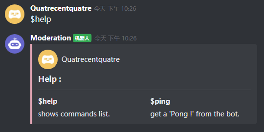

# Kaiheila.JS
### A powerful JavaScript typedful library to create Kaiheila bots easiser.

<br>
<small>(Made with ❤️ by Name#0001 on Kaiheila)</small>

<br>

# Roadmap
<ul>
    <li>&#9745;&nbsp;IntelliSens</li>
    <li>&#9745;&nbsp;Built-in functions</li>
    <ul>
        <li>&#9745;&nbsp;User</li>
        <li>&#9745;&nbsp;Guild</li>
        <li>&#9745;&nbsp;Member</li>
        <li>&#9745;&nbsp;Message</li>
        <li>&#9745;&nbsp;Reaction</li>
        <li>&#9745;&nbsp;Channel</li>
        <li>&#9745;&nbsp;Role</li>
        <li>&#9745;&nbsp;Asset</li>
    </ul>
    <li>&#9745;&nbsp;Client options</li>
    <ul>
        <li>&#9745;&nbsp;skipClientTriggers</li>
        <li>&#9745;&nbsp;packetCompression</li>
    </ul>
    <li>&#9745;&nbsp;Upgrade to new Kaiheila API</li>
    <li>&#9744;&nbsp;Voice channels</li>
</ul>

# Sample code :
```js
const Kaiheila = require('kaiheilajs'),
    { token, prefix } = require('./config.example.json'),
    client = new Kaiheila.Client(token, {
        lang: 'en-US',
        packetCompression: true,
        tokenType: 'BOT',
    })

client.once('ready', function (sessionId) {
    console.log(`Client is connected ! Session ID : ${sessionId}`)
})

client.on('message', async function (message) {
    const args = message.content.split(/ +/),
        command = args.shift().toLowerCase()

    if (command === `${prefix}help`) {
        const commands = [
                { name: `${prefix}help`, value: 'shows commands list.' },
                {
                    name: `${prefix}ping`,
                    value: "get a 'Pong !' from the bot.",
                },
            ],
            card = new Kaiheila.Card()
                .addHeader('Help :')
                .addDivider()
                .setColor('#e5a7b6')
                .addRowFields(commands, true)
                .setAuthor(message.extra.author.username, {
                    src: message.extra.author.avatar,
                    size: 'sm',
                    side: 'left',
                    circle: true,
                })

        await client.managers.message.create(message.target_id, card)
    }
})

client.login()
```

